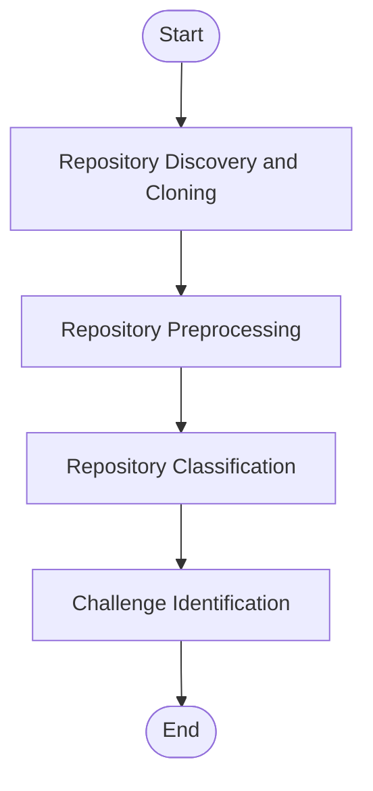
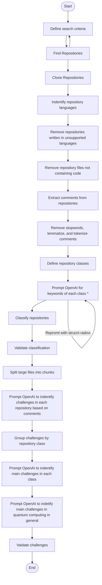
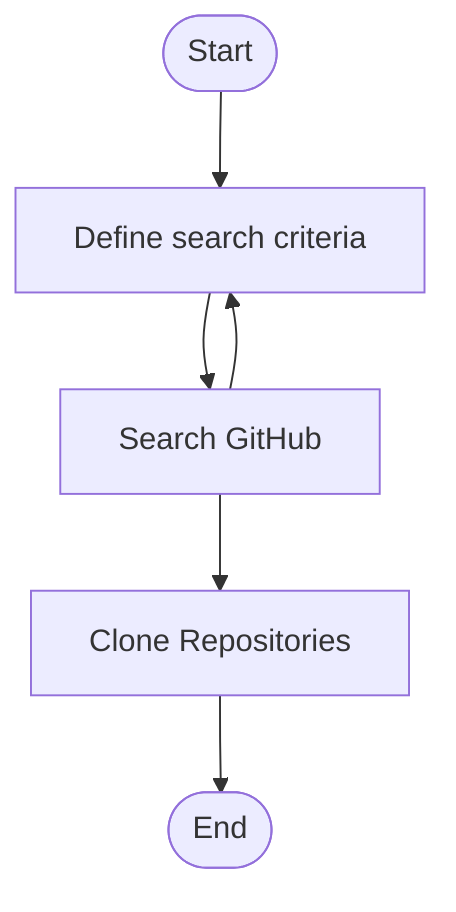
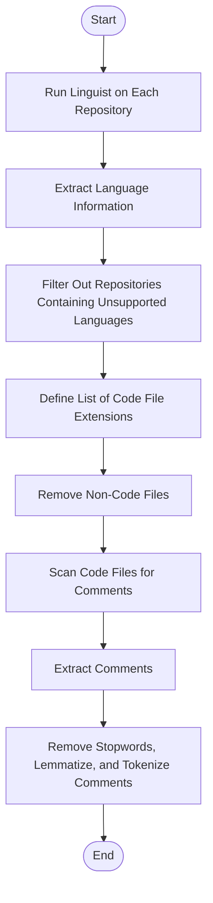
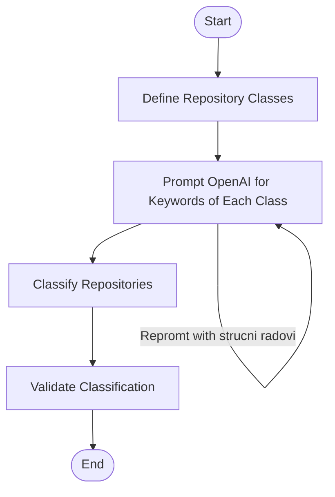
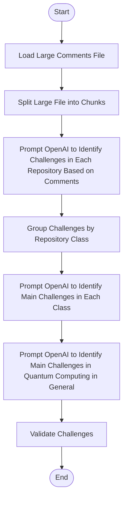

# Project Overview

```mermaid
graph TD
    A([Start]) --> B[Repository Discovery and Cloning]
    B --> C[Repository Preprocessing]
    C --> D[Repository Classification]
    D --> E[Challenge Identification]
    E --> F([End])
```

# Detailed whole project graph

```mermaid
    graph TD
    A([Start]) --> B[Define search criteria]
    B --> C[Find Repositories]
    C --> B
    C --> D[Clone Repositories]
    D --> E[Indentify repository languages]
    E --> F[Remove repositories written in unsupported languages]
    F --> G[Remove repository files not containing code]
    G --> H[Extract comments from repositories]
    H --> I[Remove stopwords, lemmatize, and tokenize comments]
    I --> J[Define repository classes]
    J --> K[Prompt OpenAI for keywords of each class *]
    K -->|Repromt with strucni radovi| K
    K --> L[Classify repositories]
    L --> M[Validate classification]
    M --> N[Split large files into chunks]
    N --> O[Prompt OpenAI to indentify challenges in each repository based on comments]
    O --> P[Group challenges by repository class]
    P --> Q[Prompt OpenAI to indentify main challenges in each class]
    Q --> R[Prompt OpenAI to indetify main challenges in quantum computing in general]
    R --> S[Vaidate challenges]
    S --> T([End])

```

# Repository Discovery and Cloning

```mermaid
    graph TD
    A1([Start]) --> B1[Define search criteria]
    B1 --> C1[Search GitHub]
    C1 --> B1
    C1 --> F1[Clone Repositories]
    F1 --> G1([End])
```

# Repository Preprocessing

```mermaid
graph TD
    A2([Start]) --> B2[Run Linguist on Each Repository]
    B2 --> C2[Extract Language Information]
    C2 --> D2[Filter Out Repositories Containing Unsupported Languages]
    D2 --> E2[Define List of Code File Extensions]
    E2 --> G2[Remove Non-Code Files]
    G2 --> H2[Scan Code Files for Comments]
    H2 --> I2[Extract Comments]
    I2 --> J2[Remove Stopwords, Lemmatize, and Tokenize Comments]
    J2 --> K2([End])
```

# Repository Classification

```mermaid
    graph TD
        A3([Start]) --> B3[Define Repository Classes]
        B3 --> C3[Prompt OpenAI for Keywords of Each Class]
        C3 --> |Repromt with strucni radovi| C3
        C3 --> D3[Classify Repositories]
        D3 --> E3[Validate Classification]
        E3 --> F3([End])
```

# Challenges Extraction

```mermaid
    graph TD
        A4([Start]) --> B3[Load Large Comments File]
        B3 --> B4[Split Large File into Chunks]
        B4 --> C4[Prompt OpenAI to Identify Challenges in Each Repository Based on Comments]
        C4 --> D4[Group Challenges by Repository Class]
        D4 --> E4[Prompt OpenAI to Identify Main Challenges in Each Class]
        E4 --> F4[Prompt OpenAI to Identify Main Challenges in Quantum Computing in General]
        F4 --> G4[Validate Challenges]
        G4 --> H4([End])
```
